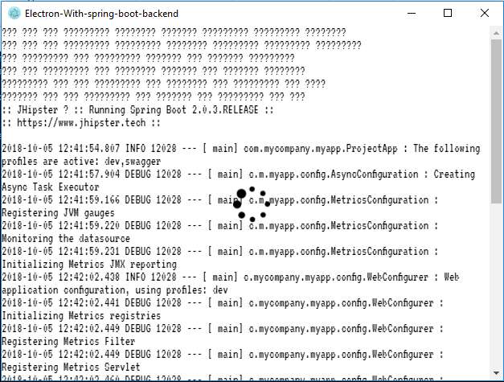

# generator-jhipster-electron 
[![NPM version][npm-image]][npm-url] 
[![Build Status][github-actions-image]][github-actions-url]
[![Dependency Status][daviddm-image]][daviddm-url]
[![Downloads][npmcharts-image]][npmcharts-url]
&nbsp;
&nbsp;<a href="https://github.com/amanganiello90/generator-jhipster-electron/issues">
</a>&nbsp;&nbsp;

> A jhipster module to run spring boot jar app in electron package. It is the jhipster module version of the yeoman [generator-electron-war-package](https://github.com/fullStackApp/generator-electron-war-package)

|Please donate whether you wish support us to give more time to app's growth | [](https://www.paypal.com/cgi-bin/webscr?cmd=_s-xclick&hosted_button_id=XTC895QYD28TC)  |
|:------------------------------------------------------------------------------|:------------------------------------------------------------------------------------------------------------------------------------------------------|


# Introduction

This is a [JHipster](http://jhipster.github.io/) module, that is meant to be used in a JHipster application. You can use it to generate an electron exe that runs your **target/*.jar package**.

> ## Notes
>
> For the features of the last release refers to [CHANGELOG.md](https://github.com/amanganiello90/generator-jhipster-electron/blob/master/CHANGELOG.md).

# Prerequisites

As this is a [JHipster](http://www.jhipster.tech/) module, we expect you to have an existing JHipster app with its prerequisites.

- [Installing JHipster](https://www.jhipster.tech/installation.html)

Or simply:

```bash
npm i -g generator-jhipster
```

# Installation

## With Yarn

To install this module:

```bash
yarn global add generator-jhipster-electron
```

To update this module:

```bash
yarn global upgrade generator-jhipster-electron
```

## With NPM

To install this module:

```bash
npm install -g generator-jhipster-electron
```

To update this module:

```bash
npm update -g generator-jhipster-electron
```

# Usage

Create a JHipster app using `yo jhipster`, or a backend-only with `yo jhipster:server`. 

In the base directory of your JHipster app, run this module. This will create an electron-app folder that packages your jar in exe.

```bash
yo jhipster-electron
```

It will be created a folder named **electron-jar-package**. After installing dependencies and generating **target/*.jar** with spring-boot, you can run in this:

* `npm start` : it runs the app in a live electron process
* `npm package` : it creates an **electron-jar 1.0.0.exe** app in **electron-jar-package/distribution**

For both, you can read the backend log into the electron window using **F1 keyword**:




> The default port used in spring boot, called from the electron app, is **8081**. You can change it in the **electron.app.config.json**

# Contributing

Please read our [guidelines](/CONTRIBUTING.md#submitting-an-issue) before submitting an issue. For feature requests, bugs and queries you can use [this template][feature-template].

# License

Apache-2.0 © [amanganiello90](https://github.com/amanganiello90)

[npmcharts-image]: https://img.shields.io/npm/dm/generator-jhipster-electron.svg?label=Downloads&style=flat
[npmcharts-url]: https://npmcharts.com/compare/generator-jhipster-electron
[github-actions-image]: https://github.com/amanganiello90/generator-jhipster-electron/workflows/Build/badge.svg
[github-actions-url]: https://github.com/amanganiello90/generator-jhipster-electron/actions
[npm-image]: https://img.shields.io/npm/v/generator-jhipster-electron.svg
[npm-url]: https://npmjs.org/package/generator-jhipster-electron
[daviddm-image]: https://david-dm.org/amanganiello90/generator-jhipster-electron.svg?theme=shields.io
[daviddm-url]: https://david-dm.org/amanganiello90/generator-jhipster-electron
[feature-template]: https://github.com/amanganiello90/generator-jhipster-electron/issues/new?body=*%20**Overview%20of%20the%20request**%0A%0A%3C!--%20what%20is%20the%20query%20or%20request%20--%3E%0A%0A*%20**Motivation%20for%20or%20Use%20Case**%20%0A%0A%3C!--%20explain%20why%20this%20is%20a%20required%20for%20you%20--%3E%0A%0A%0A*%20**Browsers%20and%20Operating%20System**%20%0A%0A%3C!--%20is%20this%20a%20problem%20with%20all%20browsers%20or%20only%20IE8%3F%20--%3E%0A%0A%0A*%20**Related%20issues**%20%0A%0A%3C!--%20has%20a%20similar%20issue%20been%20reported%20before%3F%20--%3E%0A%0A*%20**Suggest%20a%20Fix**%20%0A%0A%3C!--%20if%20you%20can%27t%20fix%20this%20yourself%2C%20perhaps%20you%20can%20point%20to%20what%20might%20be%0A%20%20causing%20the%20problem%20(line%20of%20code%20or%20commit)%20--%3E
